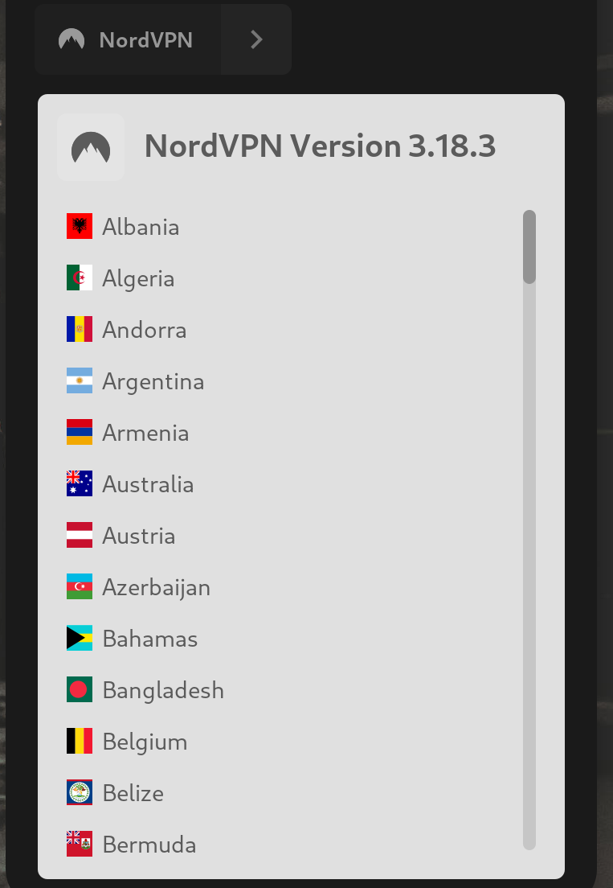
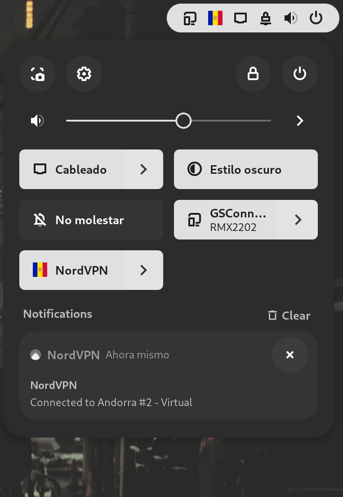

# NordVPN quick toggle

GNOME extension that shows a quick toggle to connect/disconnect NordVPN.
This extension is not affiliated, funded, or in any way associated with NordVPN.

Supports GNOME Shell version 45 and 46.

## Preview

Country selection          |  Connected
:-------------------------:|:-------------------------:
 |  

## Installation

### GNOME extensions page (recommended)

https://extensions.gnome.org/extension/7174/nordvpn-quick-toggle/

### Manual

1. Download the extension zip from the [release page](https://github.com/Wedaxi/NordVPN-Quick-Toggle/releases/tag/release) or [direct link](https://github.com/Wedaxi/NordVPN-Quick-Toggle/releases/download/release/nordvpnquicktoggle@wedaxi.com.shell-extension.zip)

2. Install the extension
    ```
    gnome-extensions install nordvpnquicktoggle@wedaxi.com.shell-extension.zip
    ```
3. Enable the extension
    ```
    gnome-extensions enable nordvpnquicktoggle@wedaxi.com
    ```  
    If this doesn't work you probably need to log out the session and back in to see the extension

## Credits

Original source for the flag icons ---> [flag-icons](https://github.com/lipis/flag-icons)